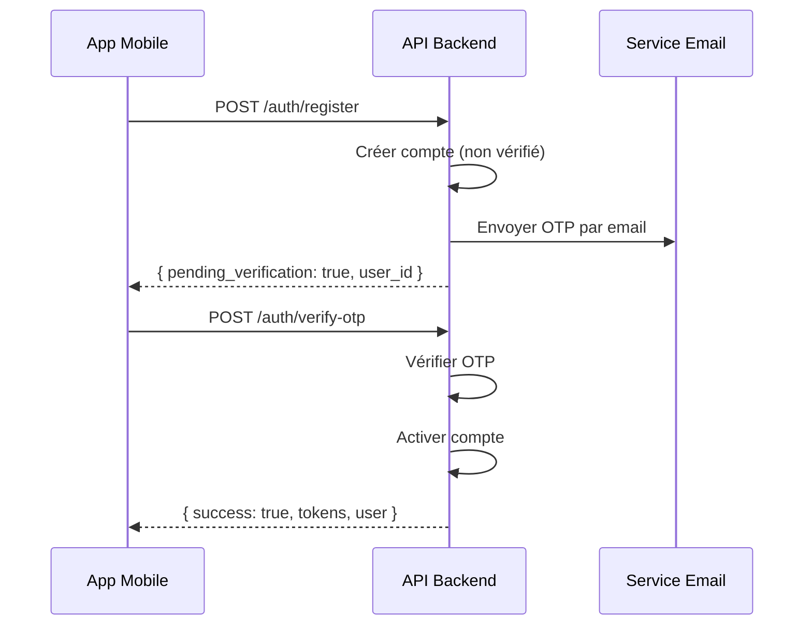

# Spécifications Backend - Vérification Email OTP

## Objectif
Implémenter une vérification par code OTP (6 chiffres) lors de l'inscription pour valider l'email de l'utilisateur avant de finaliser la création du compte.

---

## Flow d'inscription modifié



---

## Nouveaux Endpoints Requis

### 1. Modifier `POST /auth/register`

**Request (inchangée):**
```json
{
  "email": "user@example.com",
  "password": "MonMotDePasse123",
  "first_name": "Jean",
  "last_name": "Dupont",
  "phone": "0612345678"
}
```

**Response (modifiée):**
```json
{
  "success": true,
  "data": {
    "pending_verification": true,
    "user_id": "123",
    "email": "user@example.com",
    "message": "Un code de vérification a été envoyé à votre adresse email"
  }
}
```

> ⚠️ **Important**: Le compte est créé mais **inactif**. Les tokens ne sont PAS retournés à cette étape.

---

### 2. Nouveau `POST /auth/verify-otp`

**Request:**
```json
{
  "user_id": "123",
  "email": "user@example.com",
  "otp": "123456"
}
```

**Response (succès):**
```json
{
  "success": true,
  "data": {
    "user": {
      "id": "123",
      "email": "user@example.com",
      "first_name": "Jean",
      "last_name": "Dupont",
      "display_name": "Jean Dupont",
      "role": "subscriber",
      "is_verified": true
    },
    "tokens": {
      "access_token": "eyJhbGciOiJIUzI1NiIs...",
      "refresh_token": "dGhpcyBpcyBhIHJlZnJlc2...",
      "expires_in": 3600
    }
  }
}
```

**Response (erreur - code invalide):**
```json
{
  "success": false,
  "data": {
    "code": "invalid_otp",
    "message": "Code de vérification invalide"
  }
}
```

**Response (erreur - code expiré):**
```json
{
  "success": false,
  "data": {
    "code": "otp_expired",
    "message": "Le code a expiré. Veuillez en demander un nouveau."
  }
}
```

---

### 3. Nouveau `POST /auth/resend-otp`

Pour renvoyer un nouveau code si l'utilisateur ne l'a pas reçu.

**Request:**
```json
{
  "user_id": "123",
  "email": "user@example.com"
}
```

**Response:**
```json
{
  "success": true,
  "data": {
    "message": "Un nouveau code a été envoyé"
  }
}
```

---

## Spécifications Techniques

| Paramètre | Valeur |
|-----------|--------|
| Longueur OTP | 6 chiffres |
| Durée de validité | 10 minutes |
| Tentatives max | 5 (puis bloquer 15 min) |
| Stockage | Table `user_otp` ou meta WordPress |

### Structure Table `user_otp` (si applicable)
```sql
CREATE TABLE user_otp (
  id BIGINT PRIMARY KEY AUTO_INCREMENT,
  user_id BIGINT NOT NULL,
  otp_code VARCHAR(6) NOT NULL,
  expires_at DATETIME NOT NULL,
  attempts INT DEFAULT 0,
  created_at DATETIME DEFAULT CURRENT_TIMESTAMP,
  INDEX idx_user_id (user_id),
  INDEX idx_expires (expires_at)
);
```

---

## Email Template

**Sujet:** `Votre code de vérification LeHiboo`

**Corps:**
```
Bonjour {first_name},

Votre code de vérification est :

    {OTP_CODE}

Ce code expire dans 10 minutes.

Si vous n'avez pas créé de compte sur LeHiboo, ignorez cet email.

L'équipe LeHiboo
```

---

## Codes d'erreur à implémenter

| Code | Message | HTTP Status |
|------|---------|-------------|
| `invalid_otp` | Code de vérification invalide | 400 |
| `otp_expired` | Le code a expiré | 400 |
| `too_many_attempts` | Trop de tentatives, réessayez dans 15 min | 429 |
| `user_already_verified` | Ce compte est déjà vérifié | 400 |
| `user_not_found` | Utilisateur non trouvé | 404 |

---

## Checklist Backend

- [ ] Modifier `/auth/register` pour créer un compte non vérifié
- [ ] Générer et stocker le code OTP
- [ ] Envoyer l'email avec le code
- [ ] Créer endpoint `/auth/verify-otp`
- [ ] Créer endpoint `/auth/resend-otp`
- [ ] Implémenter la logique anti-brute-force
- [ ] Nettoyer les OTP expirés (cron job)
